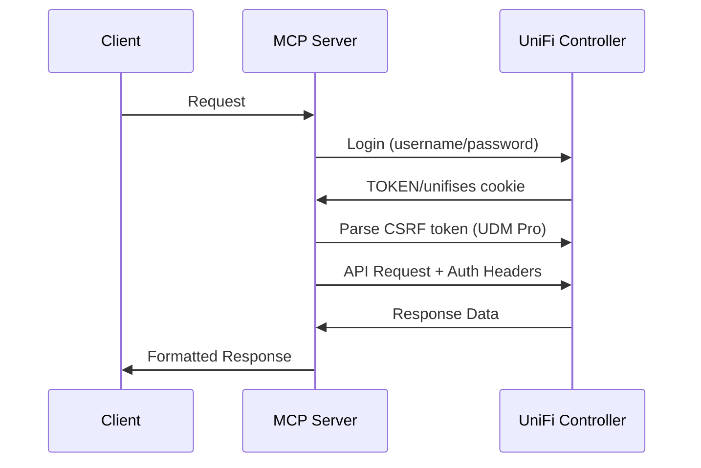

<div align="center">

# 🌐 UniFi Local Controller MCP Server

[](https://python.org)
[](https://github.com/jlowin/fastmcp)
[](#license)
[](https://ui.com)

*A powerful Model Context Protocol (MCP) server for seamless UniFi controller integration*

🚀 **Direct Local Access** • 📊 **Real-time Monitoring** • 🔧 **Device Management** • 🎯 **Clean Data Output**

</div>

---

## ✨ Overview

This MCP server provides **direct, real-time integration** with your local UniFi controller through a comprehensive suite of tools and resources. Built with modern FastMCP framework as a modular Python package, it eliminates the need for cloud dependencies while delivering clean, formatted data output with advanced logging and process management.

### 🎯 **Key Features**

| Feature | Description |
|---------|-------------|
| 🏠 **Local Integration** | Direct controller access - no cloud dependencies |
| 📡 **Real-time Data** | Live device status, statistics, and monitoring |
| 🎨 **Clean Output** | Human-readable formatting - no JSON walls |
| 🔧 **Device Control** | Restart, locate, and manage network devices |
| 📊 **Smart Analytics** | Bandwidth, DPI stats, and network insights |
| 🌐 **Universal Support** | Works with UDM Pro, Cloud Gateway Max, legacy controllers |
| ⚡ **FastMCP Powered** | Modern MCP framework with streamable HTTP transport |
| 📋 **Advanced Logging** | Prettified logs with colors and background execution |
| 🔧 **Process Management** | PID files, log streaming, and independent execution |

## 🚀 Quick Start

### 📋 Prerequisites

> **Before you begin**, ensure you have:

- 🏠 **Local UniFi Controller** (Cloud Gateway Max, UDM Pro, or traditional controller)
- 🌐 **Direct Network Access** to the controller
- 👤 **Local Admin Account** (not UniFi Cloud/SSO)
- 🐍 **Python 3.11+**
- 📦 **`uv` Package Manager**

### 🔌 Controller Compatibility

| Controller Type | Port | Examples |
|----------------|------|----------|
| 🆕 **UniFi OS Devices** | `443` | UDM Pro, UDM SE, Cloud Gateway Max, Cloud Key Gen2+ |
| 🔄 **Legacy Controllers** | `8443` | Software controllers, Cloud Key Gen1 |

> ⚠️ **Authentication Note**: Requires local admin account, **not** UniFi Cloud credentials

### ⚡ Installation

<details>
<summary><b>📥 Step-by-Step Setup</b></summary>

#### 1️⃣ **Clone and Setup**
```bash
cd unifi-mcp
uv sync
```

#### 2️⃣ **Configure Environment**
```bash
cp .env.example .env
# Edit .env with your controller details
```

#### 3️⃣ **Launch Server**
```bash
./run.sh              # Start server in background + stream logs
./run.sh logs         # Stream logs from running server
# Or directly: uv run python -m unifi_mcp.main
```

</details>

🎯 **Server Endpoint**: `http://localhost:8001/mcp`

## ⚙️ Configuration

### 🔑 Required Environment Variables

<details>
<summary><b>📝 Configuration Template</b></summary>

```bash
# 🏠 Controller Connection (scheme and port required)
UNIFI_CONTROLLER_URL=https://10.1.0.1:443  # UniFi OS (UDM Pro, Cloud Gateway Max)
# UNIFI_CONTROLLER_URL=https://10.1.0.1:8443  # Legacy controllers
UNIFI_USERNAME=admin                        # Local controller admin username
UNIFI_PASSWORD=your_password               # Local controller admin password

# 🔧 Controller Type Configuration
UNIFI_IS_UDM_PRO=true                 # true for UniFi OS devices, false for legacy
UNIFI_VERIFY_SSL=false                # false for self-signed certs, true for valid SSL

# 🌐 Server Settings
UNIFI_LOCAL_MCP_HOST=0.0.0.0          # Server bind address
UNIFI_LOCAL_MCP_PORT=8001             # Server port
UNIFI_LOCAL_MCP_LOG_LEVEL=INFO        # Logging level

# 📋 Advanced Logging & Process Management
MCP_LOG_FILE=logs/unifi-mcp.log       # Override default log file location
MCP_PID_FILE=logs/unifi-mcp.pid       # Override default PID file location
```

</details>

### 🌐 Controller URL Examples

| Type | URL Format | Use Case |
|------|------------|----------|
| 🆕 **UniFi OS** | `https://192.168.1.1:443` | UDM Pro, Cloud Gateway Max, Cloud Key Gen2+ |
| 🔄 **Legacy** | `https://unifi.example.com:8443` | Software controllers, Cloud Key Gen1 |
| 🔧 **Custom** | `https://controller:PORT` | Non-standard port configurations |

### 🔒 SSL Certificate Handling

| Certificate Type | Setting | Description |
|-----------------|---------|-------------|
| 🔓 **Self-signed** | `UNIFI_VERIFY_SSL=false` | Most common setup |
| ✅ **Valid SSL** | `UNIFI_VERIFY_SSL=true` | Trusted certificate authority |
| 📁 **Custom CA** | Provide CA bundle path | Enterprise environments |

## 🛠️ Available Tools

<div align="center">

### 🎯 **Tool Categories**

</div>

<details>
<summary><b>📱 Device Management</b></summary>

| Tool | Description | Output |
|------|-------------|--------|
| `get_devices` | List all devices | 🎨 Clean, formatted summaries |
| `get_device_by_mac` | Specific device details | 📊 Formatted device info |
| `restart_device` | Restart UniFi device | ⚡ Device reboot |
| `locate_device` | Trigger locate LED | 💡 Visual device identification |

</details>

<details>
<summary><b>👥 Client Management</b></summary>

| Tool | Description | Output |
|------|-------------|--------|
| `get_clients` | Connected clients | 🔗 Connection details |
| `reconnect_client` | Force reconnection | 🔄 Client refresh |
| `block_client` | Block client network access | 🚫 Security enforcement |
| `unblock_client` | Restore client network access | ✅ Access restoration |
| `forget_client` | Remove client historical data | 🗑️ GDPR compliance |
| `set_client_name` | Set/update client name | 📝 Device identification |
| `set_client_note` | Add notes to client record | 📋 Documentation |

</details>

<details>
<summary><b>🌐 Network Configuration</b></summary>

| Tool | Description | Output |
|------|-------------|--------|
| `get_sites` | Controller sites | 🏢 Site information |
| `get_wlan_configs` | Wireless networks | 📡 WiFi configurations |
| `get_network_configs` | Network/VLAN setup | 🔧 Network topology |
| `get_port_configs` | Switch port profiles | 🔌 Port configurations |
| `get_port_forwarding_rules` | Port forwarding | ➡️ Traffic routing rules |
| `get_firewall_rules` | Firewall security rules | 🔒 Security audit |
| `get_firewall_groups` | Firewall address groups | 👥 Security management |
| `get_static_routes` | Advanced routing configuration | 🗺️ Network routing |

</details>

<details>
<summary><b>📊 Monitoring & Statistics</b></summary>

| Tool | Description | Output |
|------|-------------|--------|
| `get_controller_status` | System information | 💻 Controller health |
| `get_events` | Recent controller events | 📅 Event timeline |
| `get_alarms` | Active system alarms | 🚨 Alert notifications |
| `get_dpi_stats` | Deep Packet Inspection | 🔍 Traffic analysis |
| `get_rogue_aps` | Rogue access points | ⚠️ Security threats |
| `start_spectrum_scan` | RF spectrum analysis | 📡 Wireless diagnostics |
| `get_spectrum_scan_state` | Scan results | 📊 RF environment data |
| `authorize_guest` | Guest network access | 🎫 Visitor authorization |
| `get_speedtest_results` | Historical speed test data | 📈 Performance analysis |
| `get_ips_events` | Security threat detection | 🛡️ Threat monitoring |

</details>

## 📋 MCP Resources

Access structured data using the `unifi://` URI scheme with **clean, filtered JSON output**:

<div align="center">

### 🎯 **Resource Categories**

</div>

<details>
<summary><b>🏢 Site & Overview Resources</b></summary>

| Resource | Description | Output Format |
|----------|-------------|---------------|
| `unifi://sites` | All controller sites | 🎨 Site summaries with health status |
| `unifi://overview` | Network overview (default site) | 📊 Infrastructure & client summary |
| `unifi://overview/{site_name}` | Network overview for specific site | 📊 Site-specific summary |

</details>

<details>
<summary><b>📱 Device Resources</b></summary>

| Resource | Description | Output Format |
|----------|-------------|---------------|
| `unifi://devices` | All devices (default site) | 🎨 Clean device summaries |
| `unifi://devices/{site_name}` | All devices for specific site | 🎨 Site-specific devices |
| `unifi://device/{site_name}/{mac}` | Individual device details | 📊 Detailed device info |
| `unifi://stats/device/{site_name}/{mac}` | Device performance stats | 📈 Traffic & system metrics |
| `unifi://device-tags` | Device tags (default site) | 🏷️ Tag assignments |
| `unifi://device-tags/{site_name}` | Device tags for specific site | 🏷️ Site-specific tags |

</details>

<details>
<summary><b>👥 Client Resources</b></summary>

| Resource | Description | Output Format |
|----------|-------------|---------------|
| `unifi://clients` | Connected clients (default site) | 🔗 Essential connection details |
| `unifi://clients/{site_name}` | Connected clients for specific site | 🔗 Site-specific clients |

</details>

<details>
<summary><b>🌐 Network Configuration Resources</b></summary>

| Resource | Description | Output Format |
|----------|-------------|---------------|
| `unifi://config/networks` | Network/VLAN configs (default site) | 🔧 Network topology |
| `unifi://config/networks/{site_name}` | Networks for specific site | 🔧 Site-specific networks |
| `unifi://config/wlans` | Wireless network configs (default site) | 📡 WiFi configurations |
| `unifi://config/wlans/{site_name}` | WLANs for specific site | 📡 Site-specific WiFi |
| `unifi://config/portforward` | Port forwarding rules (default site) | ➡️ Traffic routing rules |
| `unifi://config/portforward/{site_name}` | Port forwarding for specific site | ➡️ Site-specific rules |
| `unifi://channels` | Wireless channel info (default site) | 📶 RF channel utilization |
| `unifi://channels/{site_name}` | Channels for specific site | 📶 Site-specific channels |

</details>

<details>
<summary><b>📊 Monitoring & Statistics Resources</b></summary>

| Resource | Description | Output Format |
|----------|-------------|---------------|
| `unifi://dashboard` | Dashboard metrics (default site) | 📈 Real-time traffic data |
| `unifi://dashboard/{site_name}` | Dashboard for specific site | 📈 Site-specific metrics |
| `unifi://events` | Recent events (default site) | 📅 Event timeline |
| `unifi://events/{site_name}` | Events for specific site | 📅 Site-specific events |
| `unifi://alarms` | Active alarms (default site) | 🚨 Alert notifications |
| `unifi://alarms/{site_name}` | Alarms for specific site | 🚨 Site-specific alarms |
| `unifi://health` | Site health status (default site) | ✅ Subsystem health |
| `unifi://health/{site_name}` | Health for specific site | ✅ Site-specific health |
| `unifi://stats/dpi` | DPI statistics (default site) | 🔍 Top application traffic |
| `unifi://stats/dpi/{site_name}` | DPI stats for specific site | 🔍 Site-specific DPI |
| `unifi://rogue-aps` | Rogue access points (default site) | ⚠️ Security threats |
| `unifi://rogue-aps/{site_name}` | Rogue APs for specific site | ⚠️ Site-specific rogues |

</details>

<details>
<summary><b>🔧 System Information Resources</b></summary>

| Resource | Description | Output Format |
|----------|-------------|---------------|
| `unifi://sysinfo` | Controller system information | 💻 Hardware & software details |
| `unifi://admins` | Administrator accounts | 👥 Admin user details |

</details>

<details>
<summary><b>🎨 Data Formatting Engine</b></summary>

| Feature | Description |
|---------|-------------|
| 🧠 **Smart Summarization** | Essential info only - no JSON walls |
| 📱 **Device-Type Aware** | Custom formatting per device type |
| 🔌 **Connection-Type Aware** | Tailored wired vs wireless details |
| 📊 **Auto Conversion** | Bytes, uptimes, timestamps |
| 🔄 **Recursive Formatting** | Clean nested data structures |

</details>

### 🔐 Authentication Flow



### 🎯 Key Design Decisions

| Decision | Rationale | Benefit |
|----------|-----------|----------|
| 📦 **Modular package structure** | Organized tools, resources, config | Easy maintenance & extensibility |
| 🎯 **Default site assumption** | Most operations use "default" | Simplified API calls |
| 🎨 **Clean data presentation** | Smart formatting helpers | No overwhelming JSON |
| 📊 **Comprehensive resources** | Dashboard + detailed monitoring | Complete network visibility |
| 🔧 **Resource vs Tool pattern** | Resources for data, tools for ops | Clear separation of concerns |
| 📋 **Advanced logging** | Prettified output with process mgmt | Better debugging & monitoring |

## 👨‍💻 Development

### 🔥 Hot Reload Development

<details>
<summary><b>🚀 Development Setup</b></summary>

```bash
# Install development dependencies
uv sync --extra dev

# Run directly for development
uv run python -m unifi_mcp.main

# Background server management
./run.sh              # Start in background + stream logs
./run.sh logs         # Stream logs from running server
kill $(cat logs/unifi-mcp.pid)  # Stop background server
```

</details>

### 🧪 Testing Tools

<details>
<summary><b>🔧 API Testing Commands</b></summary>

```bash
# List available tools
curl -X POST http://localhost:8001/mcp/call \
  -H "Content-Type: application/json" \
  -d '{"method": "tools/list"}'

# Test a specific tool
curl -X POST http://localhost:8001/mcp/call \
  -H "Content-Type: application/json" \
  -d '{"method": "tools/call", "params": {"name": "get_devices"}}'
```

</details>

### 🌐 API Endpoints

| Endpoint | Purpose | Description |
|----------|---------|-------------|
| 💚 **Health** | `http://localhost:8001/health` | Server health check |
| 🔗 **MCP** | `http://localhost:8001/mcp` | Main MCP endpoint |
| ⚡ **Tools** | `http://localhost:8001/mcp/call` | Tool execution |

## 🔧 Troubleshooting

<div align="center">

### 🚨 **Common Issues & Solutions**

</div>

<details>
<summary><b>🔐 Authentication Issues</b></summary>

| Issue | Solution | Notes |
|-------|----------|-------|
| 🚫 **401 Errors** | Check username/password and controller URL | Verify credentials |
| 🔒 **MFA Required** | Disable MFA or implement MFA support | Contact admin |
| 🛡️ **SSL Errors** | Set `UNIFI_VERIFY_SSL=false` | For self-signed certs |

</details>

<details>
<summary><b>🎛️ Controller Type Issues</b></summary>

| Controller Type | Setting | Description |
|----------------|---------|-------------|
| 🆕 **UDM Pro/Cloud Gateway Max** | `UNIFI_IS_UDM_PRO=true` | Modern UniFi OS devices |
| 🔄 **Legacy Controllers** | `UNIFI_IS_UDM_PRO=false` | Traditional controllers |

</details>

<details>
<summary><b>⚠️ Common Problems</b></summary>

| Problem | Cause | Solution |
|---------|-------|----------|
| 📊 **Empty DPI Stats** | DPI disabled | Enable DPI in controller settings |
| 📱 **No Devices Found** | Insufficient permissions | Verify admin access |
| ⏱️ **Connection Timeouts** | Network issues | Check connectivity & availability |

</details>

## 🔬 Technical Details

### 🛠️ Built With

<div align="center">

| Component | Description | Link |
|-----------|-------------|------|
| 🐍 **unifi-controller-api** | Python UniFi library | [GitHub](https://github.com/tnware/unifi-controller-api) |
| ⚡ **FastMCP** | Modern MCP framework | [GitHub](https://github.com/jlowin/fastmcp) |
| 📦 **PyPI Package** | Controller API package | [PyPI](https://pypi.org/project/unifi-controller-api/) |

</div>

### 💡 Implementation Highlights

<details>
<summary><b>🎯 Smart Features</b></summary>

| Feature | Description | Benefit |
|---------|-------------|----------|
| 🏷️ **Device Model Mapping** | Translates codes ("U7PG2" → "UniFi AC Pro AP") | Human-readable names |
| 🔄 **Authentication Retry** | Auto-retry on auth failure | Network resilience |
| 🍪 **Session Management** | Handles TOKEN/unifises cookies | Seamless authentication |
| 🛡️ **CSRF Protection** | JWT token extraction & application | Security compliance |

</details>

### 🌐 Network Requirements

<details>
<summary><b>📋 Prerequisites Checklist</b></summary>

- ✅ **Direct Access**: Server → UniFi controller connectivity
- ✅ **Port Access**: HTTPS port (443/8443) accessibility  
- ✅ **Account Type**: Local controller account (not Cloud/SSO)
- ✅ **Admin Privileges**: Administrative controller access

</details>

---

<div align="center">

## 📄 License

**This project is open source.** See repository for license details.

---

*Made with ❤️ for the UniFi community*

**[⭐ Star this repo](https://github.com/jmagar/unifi-mcp)** • **[🐛 Report Issues](https://github.com/jmagar/unifi-mcp/issues)** • **[💡 Request Features](https://github.com/jmagar/unifi-mcp/issues/new)**

</div>